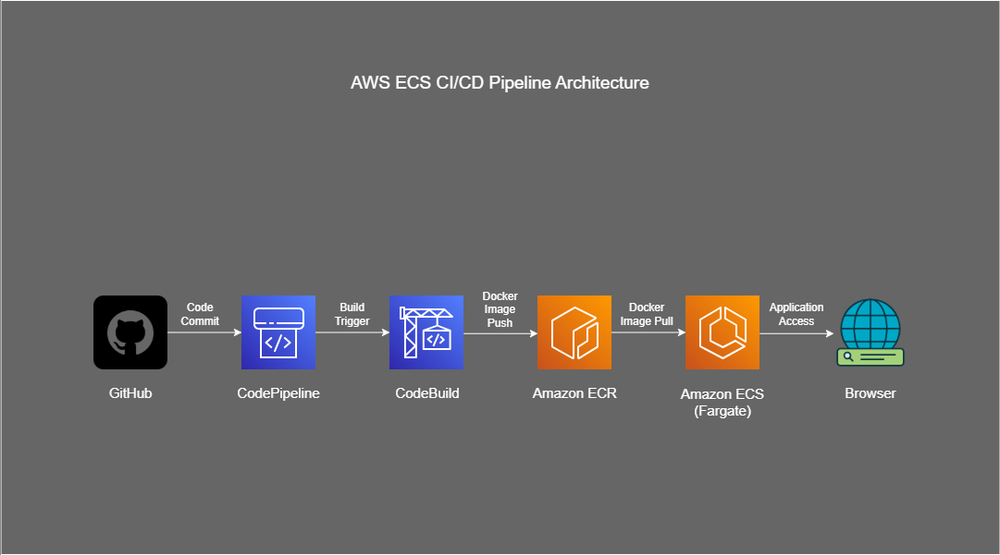
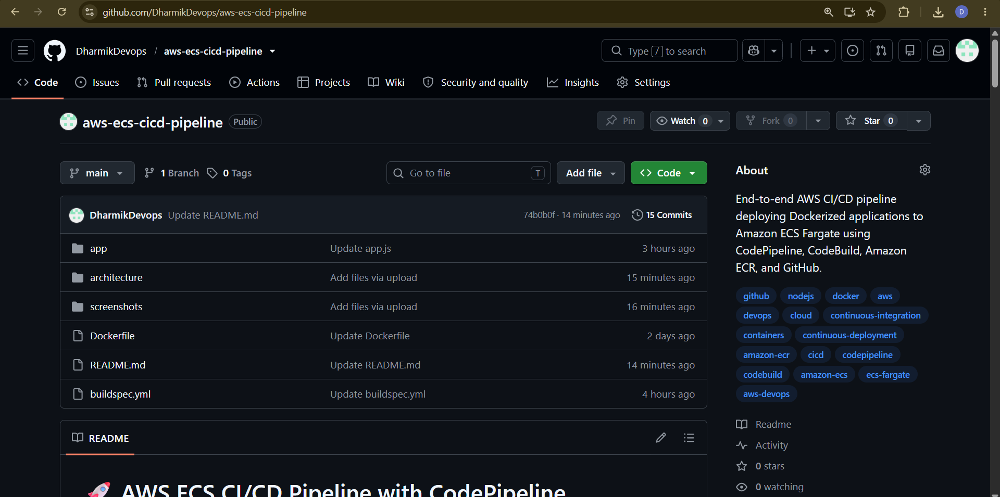
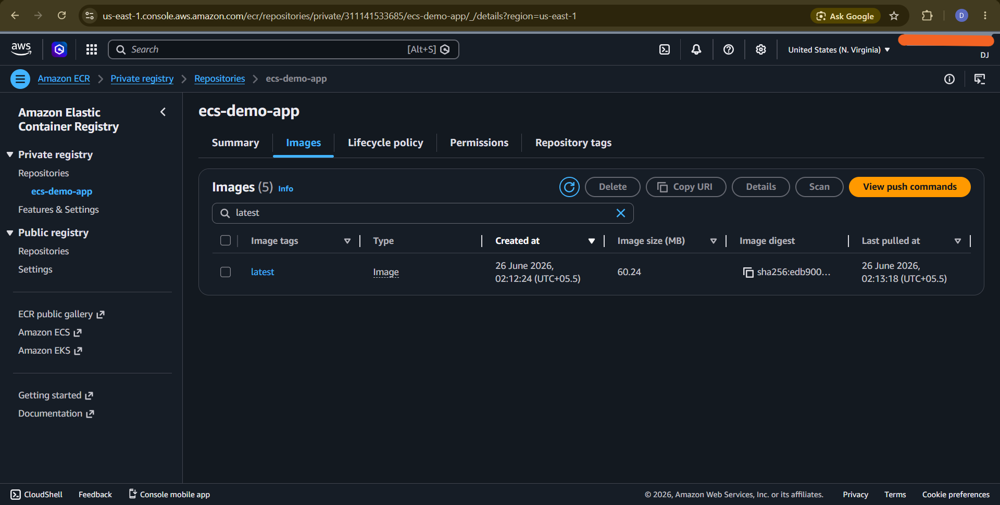
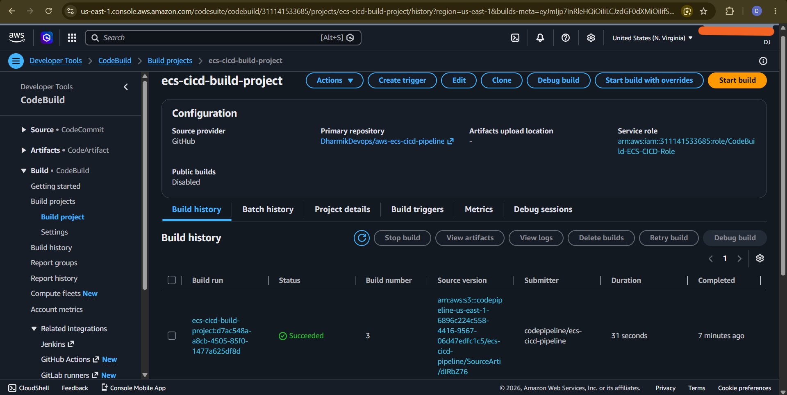
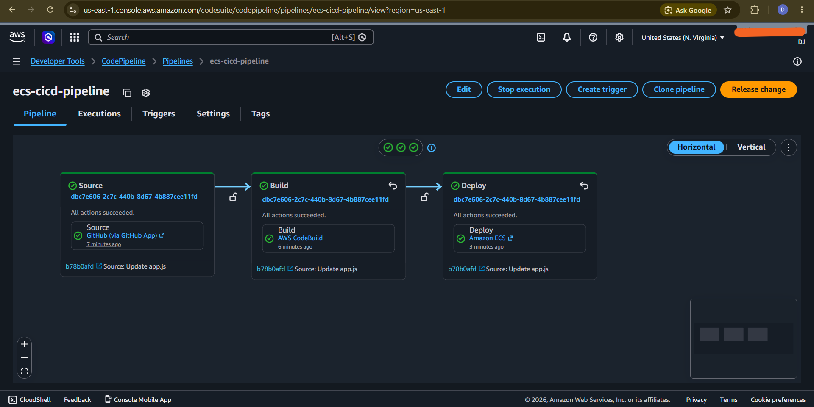
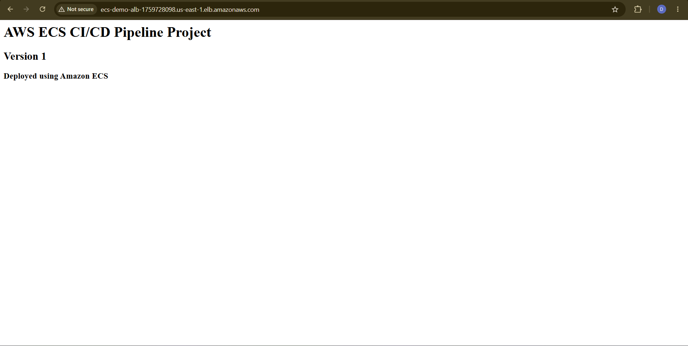
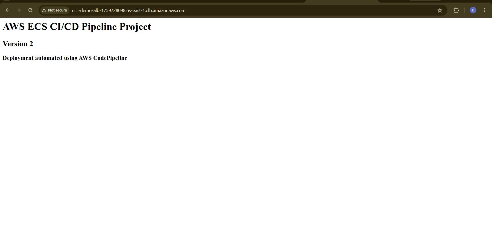

# 🚀 AWS ECS CI/CD Pipeline with CodePipeline, CodeBuild & Amazon ECR

## 📌 Overview

This project demonstrates a complete CI/CD pipeline for deploying a Dockerized Node.js application on Amazon ECS using AWS developer services.

Whenever code is pushed to the GitHub repository, AWS CodePipeline automatically triggers AWS CodeBuild to build a new Docker image, pushes the image to Amazon ECR, and deploys the latest version to Amazon ECS (Fargate) without any manual intervention.

---

## 🏗️ Architecture Diagram

---

## 🛠️ AWS Services Used

- Amazon ECS (Fargate)
- Amazon ECR
- AWS CodePipeline
- AWS CodeBuild
- GitHub
- IAM
- CloudWatch Logs

---

## 🧠 How It Works

### Step 1: Code Push

Developer pushes code changes to the GitHub repository.

### Step 2: Pipeline Trigger

AWS CodePipeline automatically detects the new commit and starts the pipeline.

### Step 3: Build Stage

AWS CodeBuild downloads the source code and:
- Builds the Docker image
- Tags the image
- Pushes it to Amazon ECR
- Generates the `imagedefinitions.json` file

### Step 4: Deploy Stage

Amazon ECS receives the new image definition and updates the running service with the latest Docker image.

### Step 5: Application Update

The ECS service launches new containers and the updated application becomes available through the browser.

---

## ⚙️ Implementation Steps

1. Created a Dockerized Node.js application.
2. Created an Amazon ECR repository.
3. Created an Amazon ECS Cluster and Service using Fargate.
4. Created a CodeBuild project with privileged mode enabled.
5. Added a `buildspec.yml` file to automate Docker build and push.
6. Created an AWS CodePipeline.
7. Connected GitHub as the source provider.
8. Configured CodeBuild as the build stage.
9. Configured Amazon ECS as the deployment stage.
10. Pushed a new application version to GitHub.
11. Verified automatic deployment to Amazon ECS.

---

## 📸 Screenshots

### GitHub Repository

### Amazon ECR Repository

### Amazon ECS Cluster and Service

### AWS CodeBuild

### AWS CodePipeline

### Application Running (Version 1)

### Application Running After CI/CD Deployment (Version 2)

---

## 💼 Real-World Use Case

This architecture is commonly used by organizations to automate container deployments. Developers simply push code to GitHub, and AWS automatically builds, stores, and deploys the latest application version to production with minimal manual effort, reducing deployment time and human errors.

---

## 🚀 Future Enhancements

- Add automated testing stage before deployment.
- Integrate Amazon ECR image scanning.
- Deploy to multiple environments (Dev, QA, Production).
- Implement Blue/Green deployments using AWS CodeDeploy.
- Add manual approval stage before production deployment.
